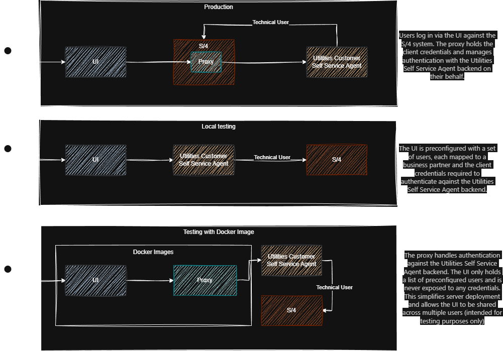

[](https://api.reuse.software/info/github.com/SAP-samples/utilities-customer-self-service-agent-utilities-demo-ui)
# Utilities Customer Self-Service Agent — Demo UI

A SAPUI5 reference application for integrating with the [Utilities Customer Self-Service Agent](https://help.sap.com/docs/utilities-self-service-agent) API. This project is intended for non-productive use only, serving as a starting point for testing and learning how to consume the API.

## Prerequisites

An active subscription to the [Utilities Customer Self-Service Agent](https://help.sap.com/docs/utilities-self-service-agent) is required before running this application.

## Installation

Install the project dependencies:

```sh
npm install
```



## Running the Application

Two execution modes are available depending on the intended use case.

### Local Development (`npm run start`)

This mode connects the UI directly to the backend and reads IAS credentials from a local configuration file. It is intended for local testing only and must not be used for any kind of deployment, as credentials are stored client-side in `config.json` in the project root.

**Setup:**

1. Create IAS credentials as described in the [official documentation](https://help.sap.com/docs/utilities-self-service-agent/administration-guide-for-utilities-customer-self-service-agent/create-dependent-application-and-api-access-credentials).
2. Set the backend service URL for the `/dssa` route in `ui5-local.yaml`.
3. Fill in the values in `config.json` in the project root. The file is pre-populated with template values — provide at minimum `clientId` and `clientSecret`, and adjust the `users` array to match the business partners you want to test with:

   ```json
   {
     "firstname": "<Firstname>",
     "auth": {
       "url": "",
       "clientId": "",
       "clientSecret": "",
       "resource": ""
     },
     "users": [
       {
         "ucssa-userid": "<User Id>",
         "businessPartners": ["<List of Connected Business Partner IDs>"],
         "ucssa-username": "<User Name>"
       }
     ]
   }
   ```

**Start the application:**

```sh
npm run start
```

### Docker (`docker compose up --build`)

This mode packages the UI as a static asset served by nginx, alongside an authentication proxy backend. It is suitable for deployment-like validation but is still not intended for production use.

**Behavior in this mode:**

1. The UI is served as static content via nginx.
2. Requests to `/dssa` are proxied from nginx to the `auth-backend` service.
3. The `auth-backend` service fetches an IAS token using environment variables and forwards requests to the destination backend.
4. IAS credentials are not exposed to the browser.
5. The frontend user list is served by `auth-backend` from environment variables — no separate `config.json` is required.
6. `config.json` is only used for local `npm run start` mode and is ignored for Docker user maintenance.

**Setup:**

1. Create a `.env` file in the project root (refer to `.env.example` for the required format).
2. Provide values for the following variables:
   - `IAS_URL`
   - `CLIENT_ID`
   - `CLIENT_SECRET`
   - `IAS_RESOURCE`
   - `DESTINATION_URL`
   - `FIRSTNAME` — display name shown in the UI header
   - `USERS` — JSON array of users selectable in the UI, e.g.:
     ```
     USERS=[{"ucssa-userid":"emma","businessPartners":["1113855"],"ucssa-username":"Emma"}]
     ```
3. Do not maintain Docker users in `config.json`; update `USERS` in `.env` instead.

**Start the containers:**

```sh
docker compose up --build
```

## Known Issues

No known issues at this time.

## Support

If you encounter a bug or have questions about this project, please [open an issue](https://github.com/SAP-samples/utilities-customer-self-service-agent-utilities-demo-ui/issues) in this repository.

## Contributing

Contributions are welcome. Please submit a pull request with your proposed changes. For legal reasons, all contributors are required to accept a Developer Certificate of Origin (DCO) upon submitting their first pull request. This is handled automatically during the submission process. SAP uses the [standard DCO text of the Linux Foundation](https://developercertificate.org/).

## License

Copyright (c) 2026 SAP SE or an SAP affiliate company. All rights reserved. This project is licensed under the Apache Software License, version 2.0, except as noted otherwise in the [LICENSE](LICENSE) file.
